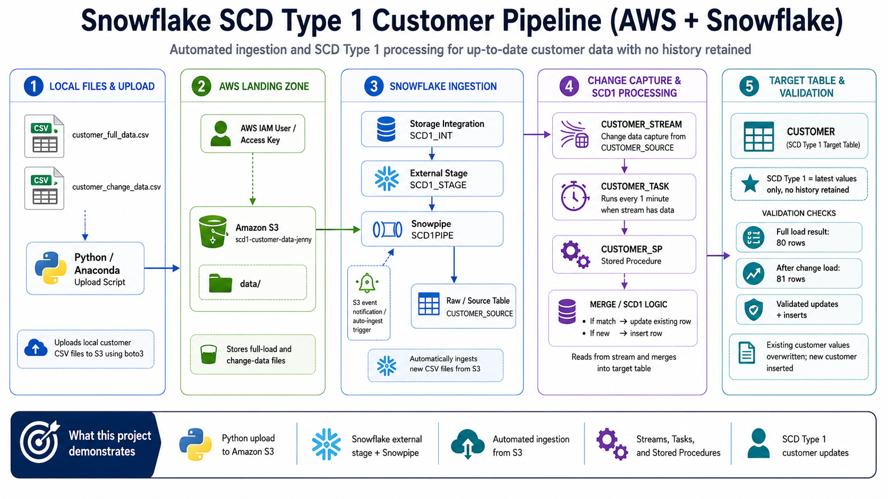

# Architecture Overview

## Project Architecture

This project demonstrates a Snowflake-centered SCD Type 1 pipeline using AWS S3, Snowpipe, Streams, Tasks, and Stored Procedures.

## High-Level Flow

```text
Local customer CSV files
→ Python upload script
→ Amazon S3 data/ folder
→ Snowflake external stage
→ Snowpipe
→ CUSTOMER_SOURCE table
→ CUSTOMER_STREAM
→ CUSTOMER_TASK
→ CUSTOMER_SP stored procedure
→ CUSTOMER target table
```

## Architecture Diagram



## Component Responsibilities

### Local CSV Files

The project uses two customer CSV files:

```text
customer_full_data.csv
customer_change_data.csv
```

The full file represents the starting customer dataset.

The change file represents customer updates and new customer records.

### Python Upload Script

The Python script uploads local customer CSV files to Amazon S3 using `boto3`.

Credentials are not hardcoded. The script uses a local AWS CLI profile named:

```text
scd1-lab
```

### Amazon S3

S3 stores the customer files in the project landing folder:

```text
s3://scd1-customer-data-jenny/data/
```

S3 acts as the cloud landing zone for incoming full-load and change-data files.

### Snowflake Storage Integration

The Snowflake storage integration allows Snowflake to securely access the S3 bucket using an AWS IAM role.

### Snowflake External Stage

The external stage points Snowflake to the S3 `data/` folder.

This allows Snowpipe to read files from S3.

### Snowpipe

Snowpipe automatically loads new CSV files from S3 into:

```text
SCD1_DB.PUBLIC.CUSTOMER_SOURCE
```

S3 event notifications trigger Snowpipe when new files are created in the `data/` prefix.

### Customer Source Table

The source table stores rows loaded from the CSV files.

```text
SCD1_DB.PUBLIC.CUSTOMER_SOURCE
```

This table receives both full-load and change-data rows.

### Customer Stream

The stream tracks new rows inserted into the source table.

```text
SCD1_DB.PUBLIC.CUSTOMER_STREAM
```

The stream allows the pipeline to process only newly loaded rows.

### Stored Procedure

The stored procedure contains the SCD Type 1 merge logic.

```text
SCD1_DB.PUBLIC.CUSTOMER_SP
```

It reads from the stream, creates a temporary work table, and merges the data into the target customer table.

### Task

The task runs every minute and only calls the stored procedure when the stream has data.

```text
SCD1_DB.PUBLIC.CUSTOMER_TASK
```

### Customer Target Table

The target table stores the current version of each customer record.

```text
SCD1_DB.PUBLIC.CUSTOMER
```

Because this is SCD Type 1, updated values overwrite old values. No history is retained.

## Why This Architecture Matters

This architecture separates responsibilities:

- Python handles local file upload.
- S3 acts as the file landing zone.
- Snowpipe handles automated ingestion.
- Streams track new rows.
- Tasks automate processing.
- Stored procedures apply SCD Type 1 merge logic.
- Snowflake stores the final customer dimension table.

This pattern is useful when a team needs automated file ingestion and current-state dimension updates without retaining historical versions.